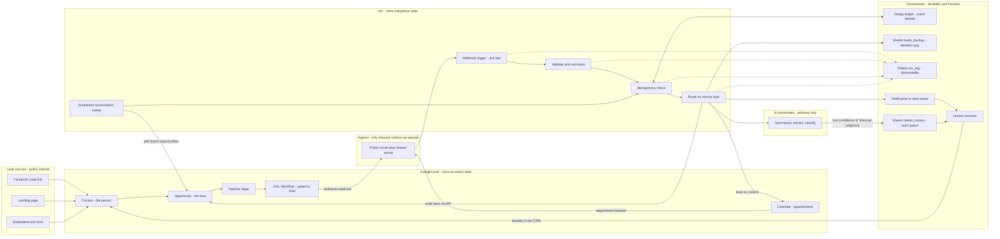

# Diagram — General architecture

How data moves between systems, and which system owns each function.

Solid arrows are the lead's path. Dotted arrows are observability, which must
never be able to fail the lead.

## Reading the diagram

**The tunnel is the only thing listening.** Every other n8n interaction is
outbound. That keeps the attack surface to a single path, which is the one
place authentication effort is worth spending.

**`IDEM` talks to the ledger in both directions — but note where it sits.** The
arrows `FB/LP/WF --> CT --> OPP` mean GHL creates the Contact and Opportunity
*before* `HOOK` ever fires. The ledger is downstream of that write, so it
prevents duplicate **processing** — a second backup row, a second AI call, a
second notification — not the CRM record that triggered it. Person-level
deduplication is GHL's own upsert. See
[`../architecture.md`](../architecture.md) §6.0, which sets out exactly what
each layer does and does not prevent.

**AI sits after routing, never before the CRM write.** If enrichment is slow or
entirely down, the lead is already a contact. Enrichment adds information; it
is never a precondition for capture.

**AI's only escalation path is `needs_human`.** It has no arrow into `OPP` or
`PIPE`, and that absence is the point — the model cannot advance a stage or
approve anything. See [DECISION-001](../decisions/DECISION-001-ai-boundaries.md).

**`RECON` bypasses the tunnel entirely.** It polls GHL directly, which is what
lets it recover leads whose webhook was never delivered — the failure that no
retry logic catches, because nothing ever arrived to retry.

**Logging is dotted throughout.** A failed log write is logged and swallowed;
it never fails the lead.

## Related

- [`../architecture.md`](../architecture.md) — components and contracts
- [`lead-lifecycle.md`](lead-lifecycle.md) — the states a lead passes through
- [`reliability.md`](reliability.md) — where this flow fails and who handles it
