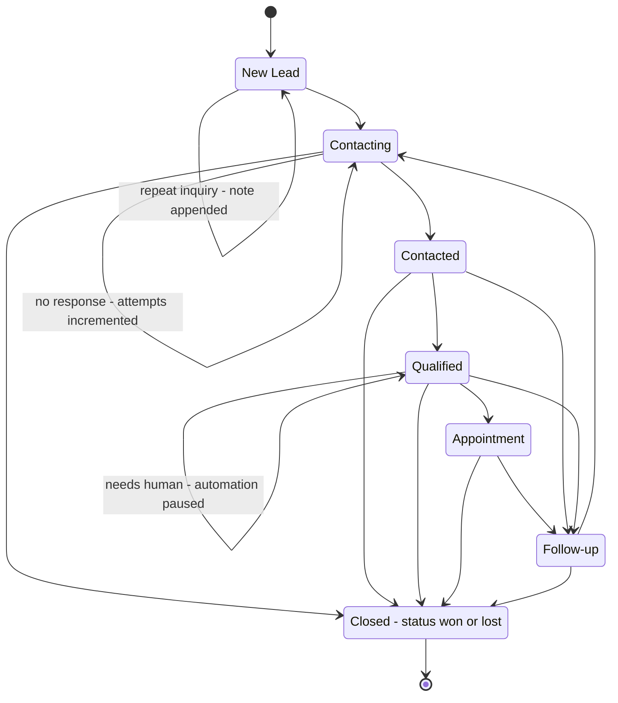
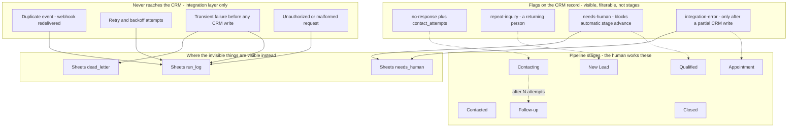

# Diagram — Lead lifecycle

The states a lead passes through, and — just as importantly — the conditions
that are deliberately **not** modelled as states.

## Pipeline stages

Only these appear on the board a salesperson works.

**Won and Lost are not stages.** A GHL Opportunity carries a native `status`
field. Keeping the outcome in `status` rather than in two terminal stages means
the board shows only live work while win-rate reporting still works.

**Self-transitions are flags, not movement.** A lead that gets no response stays
in `Contacting` — a counter changes, the stage does not. Modelling it as a stage
would force a lead that answers on day four to be dragged *backwards*, which
corrupts stage-duration metrics and teaches reps to distrust the board.

## Where each exceptional condition lives

## The rule that produced this split

> **Changes what a human does next → STAGE.**
> **Changes what the system does next → FLAG on the record.**
> **Only describes how the plumbing behaved → never reaches the CRM at all.**

Applying it to the hard cases:

| Condition | Call | Reasoning |
|---|---|---|
| **No Response** | Flag | The human keeps doing the same thing — calling. Nothing about their work changes, so nothing on the board should. After N attempts the *cadence* genuinely changes, and that transition to `Follow-up` is a real stage change. |
| **Duplicate event** | Never in the CRM | A webhook retry is our plumbing. A rep must not be able to tell from the CRM that our infrastructure was flaky. Zero artifacts — not even a note. |
| **Duplicate person** | Flag, and business-meaningful | A returning lead is a hot buying signal, the opposite of noise. It is amplified, not suppressed. Still not a stage: it describes how the deal *arrived*, not where it *is*. |
| **Requires Human** | Flag plus queue | It is orthogonal to position — it can fire at qualification, at pricing, or at document review. As a stage it would erase where the lead actually was, and you would have to guess on return. |
| **Error** | Integration layer, with one exception | Failing before touching GHL leaves nothing in GHL to mark, and a phantom "failed lead" is not something a rep can act on. But a failure *after* a partial write means the CRM itself is now inconsistent — and then a human must see it there. |
| **Retry** | Never in the CRM | Retry is a mechanism, not a state. The lead does not know it is being retried, and neither should the salesperson. |

The two hardest calls are **duplicate event** and **error**, and they share a
shape: the CRM is told only what a human can act on. Everything else is
observable in the log, where the people who maintain the pipeline look.

## Related

- [`../architecture.md`](../architecture.md) — the full lifecycle rationale
- [`reliability.md`](reliability.md) — what happens to the conditions on the right
- [`../../TEST_CASES.md`](../../TEST_CASES.md) — TC-02, TC-03, TC-08, TC-15
