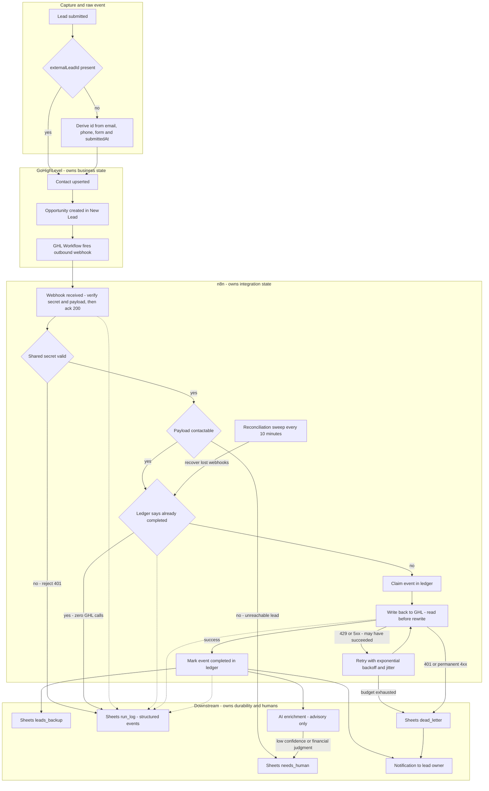

# Diagram — Reliability

Where the pipeline fails, what happens next, and which system owns each
function. Subgraphs are ownership boundaries.

## Ownership

Note on the first subgraph: it is labelled *Capture and raw event*, not
*Source*, because the id-derivation step (`A2`/`A3`) is **n8n's work** drawn at
its logical position in the flow rather than inside its owning system. The
source never owns identity — see the table below.

| Function | Owner | Why not elsewhere |
|---|---|---|
| **Capture** | Source | The only system that sees the submission |
| **Event identity** | Integration layer | A fact about our deliveries, not about the business, so the CRM cannot own it |
| **Person identity** | GoHighLevel | Its contact upsert is what stops one human becoming two contacts **[ASSUMPTION]** — matching semantics unverified |
| **Business state** | GoHighLevel | It is what the salesperson works |
| **Validation** | n8n | Rejecting at the boundary keeps malformed data out of the CRM entirely |
| **Retry and backoff** | n8n | A mechanism, never a CRM-visible fact |
| **Durability** | Sheets backup | Append-only and independent of the CRM, so it survives a CRM misconfiguration |
| **Observability** | `run_log` | Separate from backup on purpose: different trust level, different lifetime |
| **Human decisions** | A named person | A queue with no owner is a graveyard |

## Failure classes and what happens

| Failure | Retry | Safe to retry | Terminal behaviour |
|---|---|---|---|
| Bad or missing shared secret | **Never** | n/a | Reject, log, **no CRM artifact** |
| Payload has no email and no phone | **Never** | n/a | Human review. A lead nobody can contact is a human problem, not a technical one |
| GHL 401 — token expired or revoked | **Never** | n/a | Dead-letter plus immediate notification. Backoff cannot fix authorization |
| GHL 429 — rate limited | Backoff with jitter, honour `Retry-After` | **Yes** — ledger claim plus pre-check make the create repeatable | Dead-letter after budget |
| GHL 5xx or timeout | Backoff with jitter | **Only in read-before-rewrite mode** — the write may already have succeeded | Dead-letter after budget |
| Sheets append fails | Backoff, few attempts | Append is **not** idempotent | **At-least-once by choice.** A duplicate backup row is harmless; a missing one is not |
| AI timeout or malformed output | At most one | Yes — no side effects | **Degrade**: mark unknown, flag for human. The lead is created even if AI is entirely down |
| Notification fails | One | Yes | Log and continue. The Sheets queue is the durable artifact; the ping is best-effort |
| n8n crashes mid-flow | Recovered by the sweep | Read-before-rewrite | `integration-error` plus `needs-human` — the one CRM-visible error case |
| **Webhook never arrives at all** | n/a | n/a | **Reconciliation sweep.** No retry logic catches this, because nothing arrived to retry |

## Three decisions worth defending

**The ledger is claimed before the CRM write, not after.** Writing it after
means a crash in between produces a duplicate. Writing it before means a GHL
failure permanently suppresses the retry — a lost lead, which is worse. So the
claim is two-phase: `claimed` before, `completed` after. A redelivery seeing a
*stale* `claimed` proceeds, but in read-before-rewrite mode.

**Retry safety is a property of the operation, not a global setting.** Backoff
is applied where the operation is repeatable and withheld where it is not.
Blanket retry on a non-idempotent append is how one lead becomes six rows.

**The backup path accepts duplicates and refuses loss.** The two failure modes
are not symmetric: a duplicate row is a nuisance a reader can dedupe by
`externalLeadId`; a missing row is unrecoverable. The design chooses the
recoverable failure on purpose.

## What this diagram does not solve

- **A source that silently stops sending.** Absence of events is the hardest
  failure in this class and needs volume baselining, which is out of scope.
- **True exactly-once.** See [ADR-002](../decisions/ADR-002-idempotency-strategy.md) §Race window.
- **Automated dead-letter replay.** Replay is manual in demo scope.

## Related

- [`../architecture.md`](../architecture.md) — reliability section
- [ADR-002](../decisions/ADR-002-idempotency-strategy.md) — why retry safety depends on identity
- [`../../TEST_CASES.md`](../../TEST_CASES.md) — TC-09 through TC-12
